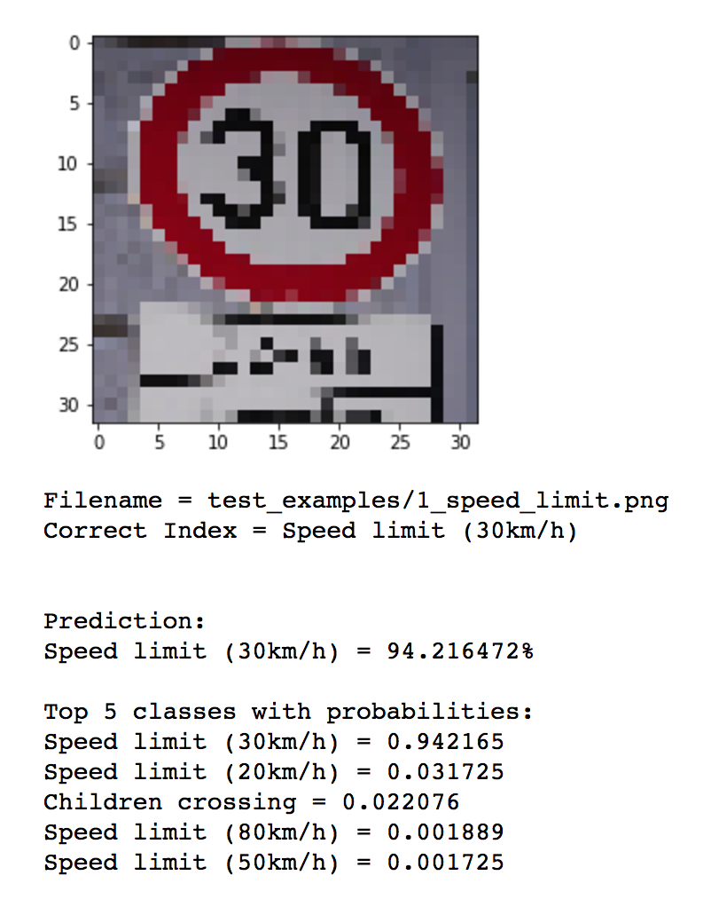

## Project: Build a Traffic Sign Recognition Program

Overview
---
In this project, you will use what you've learned about deep neural networks and convolutional neural networks to classify traffic signs. You will train and validate a model so it can classify traffic sign images using the [German Traffic Sign Dataset](https://d17h27t6h515a5.cloudfront.net/topher/2017/February/5898cd6f_traffic-signs-data/traffic-signs-data.zip). After the model is trained, you will then try out your model on images of German traffic signs that you find on the web.


To meet specifications, the project will require submitting three files:
* the Ipython notebook with the code
* the code exported as an html file
* a writeup report either as a markdown or pdf file

[//]: # (Image References)

[image1]: ./test_examples/1_30_limit.png "Traffic Sign 1"
[image2]: ./test_examples/1_speed_limit.png "Traffic Sign 2"
[image3]: ./test_examples/4_no_passing_speed_limit_70.png "Traffic Sign 3"
[image4]: ./test_examples/18_general_caution.png "Traffic Sign 4"
[image5]: ./test_examples/21_Double_curve.png "Traffic Sign 5"
[image6]: ./test_examples/22_bumpy_road.png "Traffic Sign 6"
[image7]: ./test_examples/25_Road_work.png "Traffic Sign 7"
[image8]: ./test_examples/28_children_crossing.png "Traffic Sign 8"
[image9]: ./test_examples/28_children_crossing_small.png "Traffic Sign 9"

### Data Set Summary & Exploration
##### Dataset Summary
The dataset was downloaded the link above (as given in project instructions) and had training, test and validation set pickles. I used them for the project and I used scikit library to summarize this dataset, results are as shown below:
        
        Number of training examples = 34799
        Number of testing examples = 12630
        Image data shape = (32, 32, 3)
        Number of classes = 43
        
##### Exploratory Visualization 
  The dataset can be visualized according to the number of samples in each of the classes as shown below:

   

 As seen the dataset is a unbalanced in terms of the number of samples per class. This causes further processing of training set in order to balance this bias.

### Design and Test a Model Architecture
##### Preprocessing
 In order to reduce any bias towards a category it is necessary to shuffle the dataset. I did it by:
 
```python
from sklearn.utils import shuffle
X_train, y_train = shuffle(X_train, y_train)
```
In order to account for the unbalanced dataset I used the keras ImageDataGenerator to generate augmented images for the dataset.

```python
 datagen = keras.preprocessing.image.ImageDataGenerator(
    shear_range=0.1,
    zoom_range=0.1,
    height_shift_range=0.1,
    fill_mode='nearest',
)
```

##### Model Architecture

 - The first approach to the model was default lenet and basic set of images. However it seemed that after about 20 epocs the accuracy flattened and there was no improvement in accuracy of ~94%. Also the model seemed to run slow as the number of epocs increased.
 - I removed a fully connected layer and added normalization to convolutional step, which seemed to further improve accuracy and speed of training.
 - Although the accuracy of the model was ~96%, it seemed to show errors in predicting the test images. To improve this error rate, I decided to augment the data. 
 - As the initial step for the model, I first grab the training set from the downloaded dataset and shuffle it
 - After shuffling the dataset is divided into batches of 128 . I add the augmented data to the training set, (the default size of augmented batch is 32), so the total batch size is 160.
 - The basic model architecture for the project was similar to lenet, only difference was removing the fully connected layer at before the output layer. The following code shows the model implementation:

```python
def LeNet(x):    
    #Layer 1: Convolutional. Input = 32x32x1. Output = 28x28x6.
    conv_l1 = conv2d(x, weights['wc1'], biases['bc1'], is_training=phase)

    #Pooling. Input = 28x28x6. Output = 14x14x6.
    conv_l1 = maxpool2d(conv_l1)

    #Layer 2: Convolutional. Output = 10x10x16.
    conv_l2 = conv2d(conv_l1, weights['wc2'], biases['bc2'], is_training=phase)
        
    #Pooling. Input = 10x10x16. Output = 5x5x16.
    conv_l2 = maxpool2d(conv_l2)
    
    #Layer3:  Flatten and fully connected: Input = 5x5x16. Output = 400.
    flat = flatten(conv_l2)
    fc1 = tf.reshape(flat, [-1, weights['wd1'].get_shape().as_list()[0]])
    fc1 = tf.add(tf.matmul(fc1, weights['wd1']), biases['bd1'])
    fc1 = tf.nn.relu(fc1)
    fc1 = tf.nn.dropout(fc1, keep_prob)
    
    #  Layer 4: Fully Connected. Input = 400. Output = 120.
    fc2 = tf.reshape(fc1, [-1, weights['wd2'].get_shape().as_list()[0]])
    fc2 = tf.add(tf.matmul(fc2, weights['wd2']), biases['bd2'])
    fc2 = tf.nn.relu(fc2)
    fc2 = tf.nn.dropout(fc2, keep_prob)

    #output layer: Input: 120 Output: 43
    logits = tf.add(tf.matmul(fc2, weights['out']), biases['out'])
    
    return logits
```

The above shows the layers in the CNN and the shapes. In this case I applied batch normalization to normalize the output of convolutional layer.

```
def conv2d(x, W, b, strides=1, is_training=False):
    x = tf.nn.conv2d(x, W, strides=[1, strides, strides, 1], padding='VALID')
    x = tf.nn.bias_add(x, b)
    x = tf.contrib.layers.batch_norm(x, decay=0.99, is_training=is_training,
                                              updates_collections=None)
    return tf.nn.relu(x)
```

It seems that the model converges faster after applying batchnormalization.

**Note:** On batchnormalization and deep neural networks: https://arxiv.org/abs/1502.03167

##### Model Training
The optimizer used for training was AdamOptimizer. I trained the model for 100 epocs, and the batch size for training was 160 (128 + 32)

##### Solution Approach
The model above showed an accuracy of >97%. Results from a sample run as seen after 100 epocs, for the validation set and for the test set are shown below:
```python
EPOCH 100 ...
Validation Loss = 0.092
Validation Accuracy = 0.980

Test Set Loss = 0.188
Test Set Accuracy = 0.962
```
### Test a Model on New Images
##### Acquiring New Images
I downloaded new images from Google to test the accuracy of the predictions from the model trained with the architecture above. Here are the images that I found on the web:

![alt text][image1] ![alt text][image2] ![alt text][image3]
![alt text][image4] ![alt text][image5]![alt text][image6]
![alt text][image7] ![alt text][image8] ![alt text][image9]

##### Performance on New Images
The model seemed to predict the images mostly correctly. Even if the sign was not at the center of the test image, the model managed to predict the image correctly. In one instance where the model was wrong in prediction was when there were two signs in the picture.

   
   

The model predicted 8 out of 9 images correctly which is 88% accurate (all except 2 signs in the image).
   
##### Model Certainty - Softmax Probabilities
From the output of the five top probabilities, it can be seen that the model is very certain of the prediction, most of the predictions are above 95%. However there are some exception. For example the bumpy road traffic sign was predicted correctly with 59% accuracy, but it was still at the top of the top 5 predictions. Following few images show the predictions and the results for a couple of test images. 

   
   


